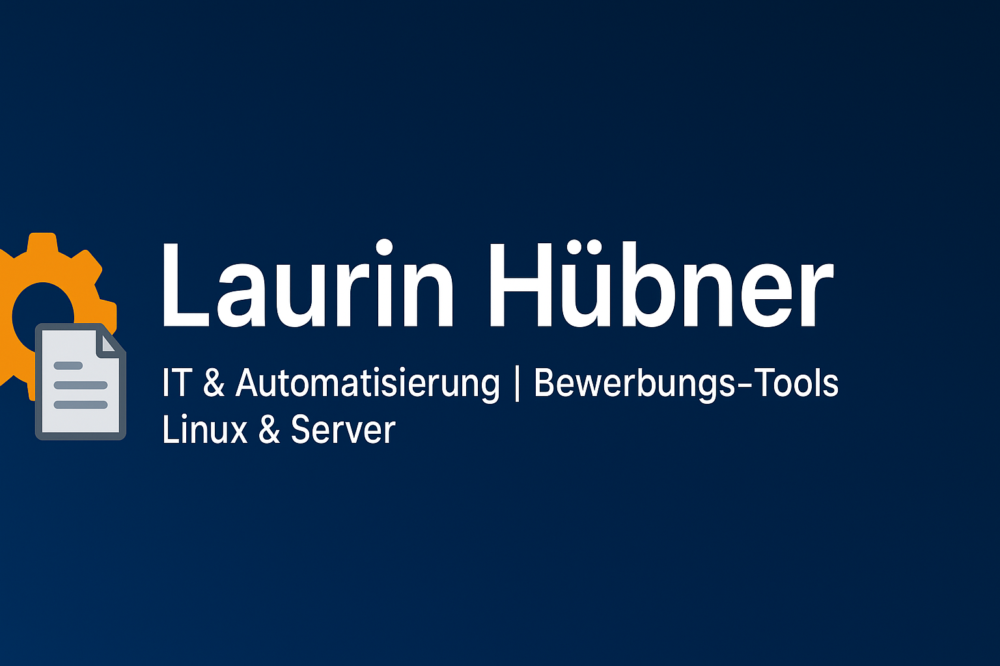

  

# 👋 Hi, ich bin Laurin Hübner  

Willkommen auf meinem GitHub-Profil!  
Hier findest du meine Projekte rund um **IT, Automatisierung, Web, Server & Bewerbungs-Tools**.  
Mein Schwerpunkt liegt auf **praktischen Lösungen mit Linux, Python & modernen Technologien**.  

---

## 🚀 Lebenslauf Online
👉   
Eine moderne Web-Version meines CVs, optimiert für Bewerbungen und einfach teilbar.

---

## 🛠️ Technologien & Tools

---

## 📂 Projekte

### Bewerbungs- & CV-Tools
- [**Bewerbungs-Generator (Anschreiben + Lebenslauf)**](https://github.com/laurinhuebner/Bewerbungs-Generator)  
    
    
  *Interne Streamlit-WebApp: erstellt individuelle Anschreiben & Lebensläufe auf Basis von Stellenanzeigen.*  
  📸 Screenshot:  
  

- [**Lebenslauf Online**](https://laurinhuebner.github.io/resume/)  
    
    
  *Interaktive Webseite mit allen wichtigen Infos über mich – moderne Alternative zum klassischen PDF-Lebenslauf.*  
  👉 

- [**resume (Quellcode)**](https://github.com/laurinhuebner/resume)  
    
  *Der Code für meine Lebenslauf-Webseite – gebaut mit HTML, CSS & etwas JavaScript.*

### KI & Automatisierung
- [**ads2letter**](https://github.com/laurinhuebner/ads2letter)  
    
    
  *Tool, das mithilfe von KI Jobausschreibungen automatisch in individuelle Bewerbungsanschreiben umwandelt.*

- [**ads2letter-webapp**](https://github.com/laurinhuebner/ads2letter-webapp)  
    
    
  *Einfache Android-App, die ads2letter aus dem lokalen Netzwerk heraus nutzbar macht – ohne den Umweg über den Browser.*

- [**Audio-Transcriber-App**](https://github.com/laurinhuebner/Audio-Transcriber-App)  
    
    
  Lokales Transkriptions-Tool: WebApp + Android-WebView-App. Ermöglicht Aufnehmen oder Hochladen von Audio und automatische Umwandlung in Text. Proof of Concept und Showcase.  
  📸 Screenshot:  
  

### Server, Monitoring & Netzwerk
- [**server-dashboard**](https://github.com/laurinhuebner/server-dashboard)  
    
    
  *Eigenes Web-Dashboard auf Debian-Server: Systemübersicht, Logs, Services, Docker & mehr.*  

- [**lan-scanner**](https://github.com/laurinhuebner/lan-scanner)  
    
    
  *Webtool (Flask) zum Scannen eines Subnetzes – findet aktive Hosts, prüft Standardports & speichert Ergebnisse in SQLite.*  
  🔗 **Integration:** Der LAN-Scanner ist **im Server-Dashboard eingebettet** (iFrame / optional via Reverse-Proxy).

---

## 🔄 Automatisch aktualisierte Projekte
<!-- RECENT_PROJECTS_START -->
- [**laurinhuebner**](https://github.com/laurinhuebner/laurinhuebner)  
  *Persönliches GitHub-Profil: interaktive Projekte, Web‑CV, KI‑Tools, Server‑Monitoring & Netzwerk-Scanner*
- [**resume**](https://github.com/laurinhuebner/resume)  
  *Mein interaktiver Online-Lebenslauf – gebaut mit GitHub Pages, jederzeit abrufbar.*
- [**Audio-Transcriber-App**](https://github.com/laurinhuebner/Audio-Transcriber-App)  
  *Ein lokales Transkriptions-Tool, bestehend aus einer WebApp und einer Android-App (WebView).   Die Anwendung ermöglicht das Aufnehmen oder Hochladen von Audio und die anschließende automatische Umwandlung in Text.   Sie ist als Proof of Concept und Portfolio-Projekt gedacht und läuft ausschließlich im internen Netzwerk.*
- [**ads2letter**](https://github.com/laurinhuebner/ads2letter)  
  *KI-gestützte App für Bewerbungen: wandelt Jobs in Anschreiben um, inkl. integriertem Crawler für aktuelle Stellenangebote. Quellcode privat, Showcase mit Screenshots und Funktionsbeschreibung.*
- [**Bewerbungs-Generator**](https://github.com/laurinhuebner/Bewerbungs-Generator)  
  *Lokale WebApp zur automatisierten Erstellung von Bewerbungsunterlagen. Mit Anschreiben-Generator, interaktivem Lebenslauf-Editor, PDF/DOCX-Export und Android-WebView-App für mobilen Zugriff. Quellcode privat, Showcase mit Screenshots und Funktionsbeschreibung.*
<!-- RECENT_PROJECTS_END -->

---

## ✨ Über mich
- 🌱 Lerne aktuell mehr über **Netzwerke, Linux-Server & Python**  
- 💡 Interesse an **Automatisierung, Webprojekten & neuen Technologien**  
- 🎯 Ziel: Ausbildung & langfristige Perspektive als **Fachinformatiker Systemintegration**

---

📫 Kontakt: [bewerbung@huebner.business](mailto:bewerbung@huebner.business)  
🌍 Webseite: [Lebenslauf Online](https://laurinhuebner.github.io/resume/)
